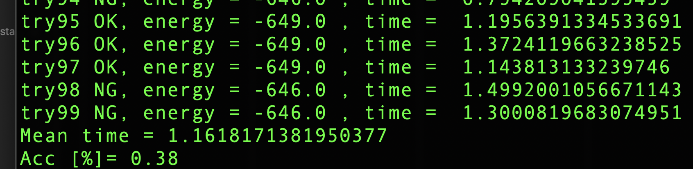
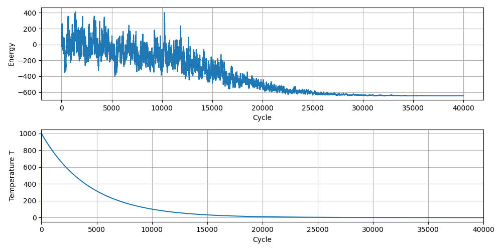

# SSQA-for-GI (Stochastic simulated quantum annelinag for graph isomophism)


SSQA-for-GI is a Python project that utilizes Stochastic Simulated Quantum Annelinag (SSQA) for Graph Isomorphism (GI) tasks. The project aims to develop a robust algorithm to assess the quality, by evaluating their performance in solving Graph Isomorphism problems. The GI problem is a classical computational problem in which two given graphs, G and H, are determined to be isomorphic if there exists a bijective mapping between their vertex sets that preserves adjacency.

This repository contains an implementation of the SSQA algorithm to tackle the GI problem as described in the research paper ["Stochastic Quantum Monte Carlo Algorithm for Large-Scale Combinatorial Optimization Problems"](https://arxiv.org/abs/2302.12454).

## Installation

### Prerequisites

- Python 3.x

### Clone the Repository

```sh
git clone https://github.com/nonizawa/SSQA-for-GI.git
cd SSQA-for-GI
```

## Run

### SSQA (Stochastic simulated quantum annelinag)

### SA (Taditional SA)
To run the main script, simply execute the `sa.py` file using Python. For example:

```sh
python sa.py --N 5 --Mcycle 1000 --trial 100 --T_ini 1000 --T_end 0.1 -tau 1
```

Here ia the options.

--N: Number of nodes in a GI problem

--Mcycle: Number of cycles for 1 trial

--trial: Number of trials to evaluate the performance on average

--T_ini:  A pseudo temperature starts at T_ini

--T_min: A pseudo temperature ends at T_ini

--tau:  A pseudo temperature is decreased every tau cycle

You can see the simulation results in terminal, such as mean simulation time and accuracy. For example:


Also, you can see the energy (Hamiltonian) and pesudo temperature (T) versus cycles. For example:



## Structure

- `./graph/`: This directory contains the dataset of graphs used for evaluation.
- `sa.py`: This is the main Python script that runs the SA for GI algorithm.
- `GI_p50_dataset.mat`" This is dataset of GI problems where edges between nodes exist with 50\%.
- `convet.py`: This is the Python script that converts GI_p50_dataset.mat to J and h in ./graph.
- `common.py`: This is used for sa.py 

## Contact

For any questions, issues, or inquiries, feel free to create an issue in the repository or contact the repository owner [@nonizawa](https://github.com/nonizawa).

## Citation

If you use this code in your research, please cite the original paper:
```bibtex
@misc{onizawa2023stochastic,
      title={Stochastic Quantum Monte Carlo Algorithm for Large-Scale Combinatorial Optimization Problems}, 
      author={Naoya Onizawa and Ryoma Sasaki and Duckgyu Shin and Warren J. Gross and Takahiro Hanyu},
      year={2023},
      eprint={2302.12454},
      archivePrefix={arXiv},
      primaryClass={quant-ph}
}
```

Here is a bibtex for the code.
```bibtex
@misc{nonizawa_SSQAforGI,
	author = {Onizawa, Naoya},
	title = {{SSQA-for-GI}},
	year = {2023},
	journal = {GitHub Repository},
	url = {https://github.com/nonizawa/SSQA-for-GI}
	}
```

## License

This project is licensed under the MIT License.
